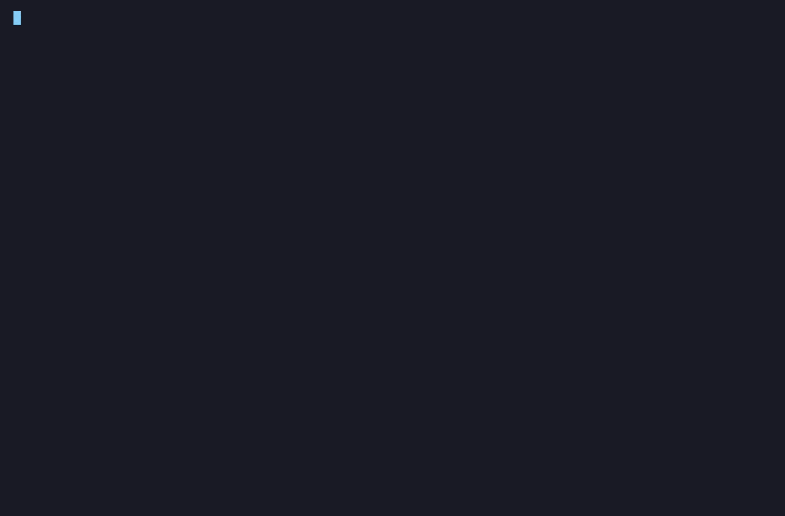
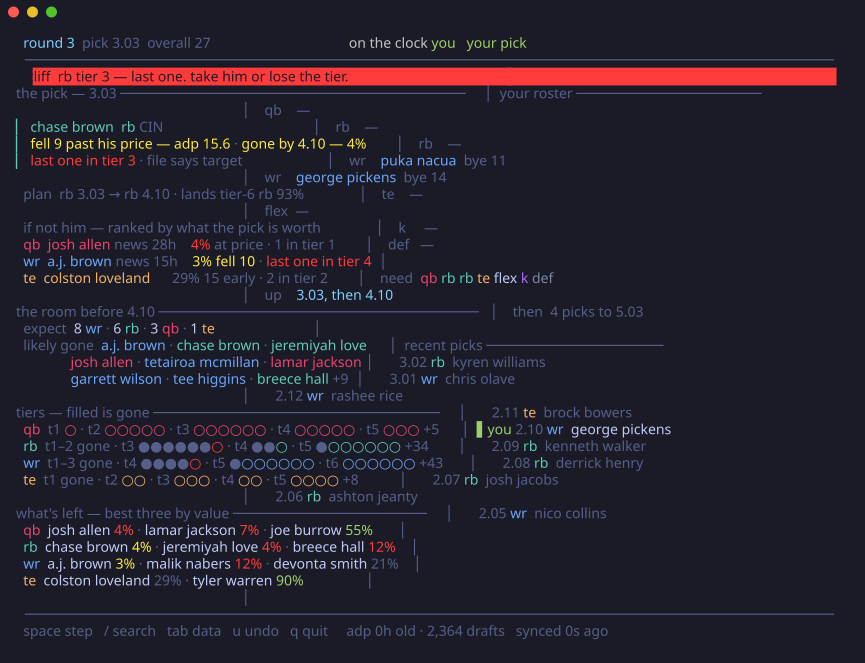
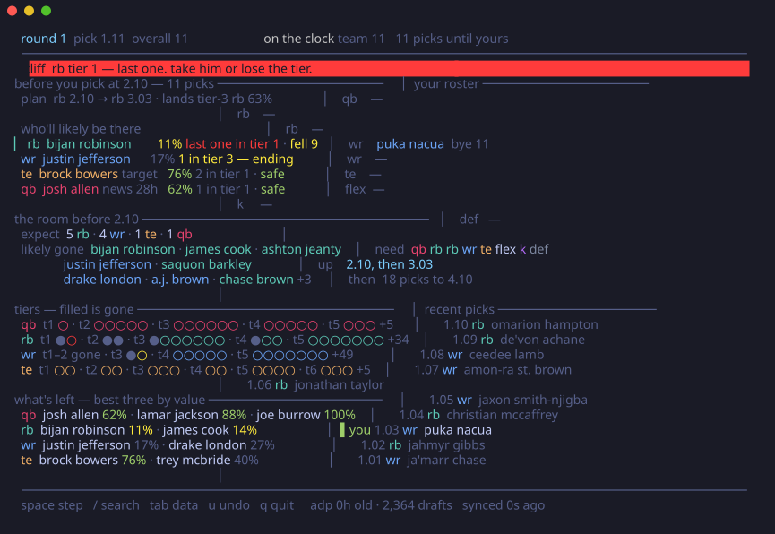
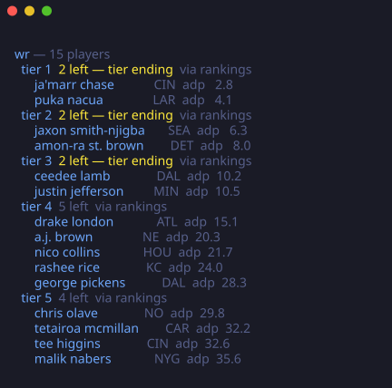
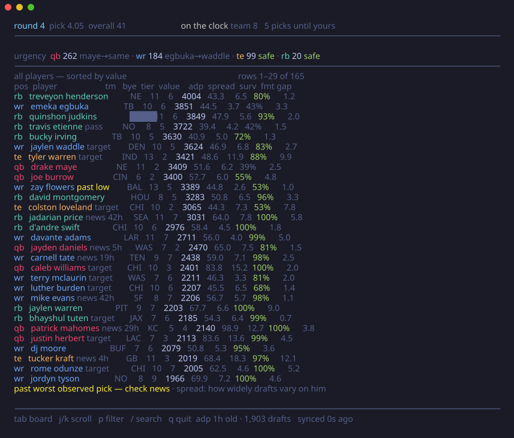
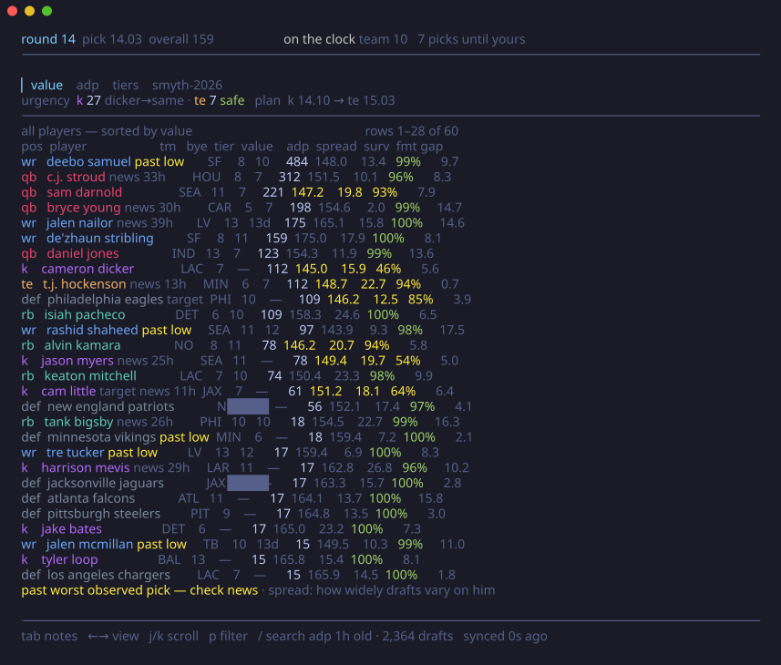

<p align="center">
  
</p>

<h1 align="center">pick6</h1>

<p align="center">
  Terminal war room for fantasy football drafts. Live-syncs Sleeper, tracks tiers,
  and tells you when the RB run means the value's gone.
</p>

<p align="center">
  <a href="https://github.com/trisslazaj/pick6/releases/latest"></a>
  <a href="https://github.com/trisslazaj/pick6/actions/workflows/ci.yml"></a>
  <a href="LICENSE"></a>
</p>



A scripted room drafts, the cliff banner fires, the ranking re-sorts under it; `a` stops the
clock, `/` finds a player, and `tab` drops to every number the engine holds. Recorded from the
real thing — [`docs/demo.tape`](docs/demo.tape), `vhs docs/demo.tape` to regenerate.

## what it does

- **Survival odds on every player** — the chance he's still there at your next pick, from
  measured draft data, corrected for the picks actually between you and your turn.
- **Tiers that alarm** — amber when a tier is probably gone before you act, red when the man on
  screen is the last of it. Tiers come from your rankings file; where it runs out, they're
  derived from the value curve.
- **Run detection that isn't noise** — four RBs in six picks only fires when it beats what the
  market itself expected for those picks.
- **Your room, not the market** — feeds it your league's past drafts and it reprices survival
  against how *those* people actually draft.
- **A verdict, not a spreadsheet** — on the clock it names a man and the two or three facts that
  justify him, in picks and odds rather than abstract points.

## install

**Download a release** (no toolchain needed) — grab the tarball for your platform from the
[releases page](https://github.com/trisslazaj/pick6/releases/latest), then:

```sh
tar -xzf pick6_*.tar.gz
xattr -d com.apple.quarantine pick6   # macOS only: clears the "unverified developer" block
mv pick6 ~/bin/                       # or anywhere on your PATH
pick6 version
```

`checksums.txt` on the release page carries the sha256 of every tarball.

**Or with Go:**

```sh
go install github.com/trisslazaj/pick6/cmd/pick6@latest
```

That installs to `go env GOPATH`/bin, which is often not on PATH — `GOBIN=$HOME/bin go install ...`
puts it somewhere that is. Working on the code? `go run ./cmd/pick6 <cmd>` always runs current source.

## quickstart

```sh
pick6 fetch                          # 1. pull data (players, adp, values, tiers)
pick6 live <draft_id> -user yourname # 2. sync your live sleeper draft
```

That's the whole thing. **Your draft id is in the url**: open the draft room in a browser and
it reads `sleeper.com/draft/nfl/<draft_id>`. `-user` finds your seat from the draft order;
`-slot 4` sets it directly if the draft hasn't been seeded yet.

No Sleeper league? `pick6 board` runs the same war room with you typing the picks.

## commands

### `pick6 fetch` — pull the data

Downloads the Sleeper player pool, half-PPR ADP, and player values; joins everything onto
Sleeper ids; applies your rankings; caches it all. Run it once before drafting and again on
draft morning — inside 12 hours it's served from disk.

```sh
pick6 fetch                            # defaults: 12-team half-ppr
pick6 fetch -format ppr                # other scoring
pick6 fetch -rankings my-tiers.csv     # your tiers and points win (see below)
```

### `pick6 live <draft_id>` — the main event

Polls the draft every few seconds and updates the board in place. Every pick is cross-checked
against the snake math; traded picks land on the right roster; a dropped poll self-heals on the
next one. Reads your league's real lineup (two flex? superflex?) from Sleeper.



On the clock the board leads with a **verdict** — the man, his price, his odds, the tier he's
the last of — then the field ranked by what the pick is worth.

### `pick6 board` — no feed, same brain

For in-person drafts, or any platform without an API. `/` finds a player, `x` marks him gone,
`u` takes it back. Everything downstream is identical — the engine never asks where a pick
came from.

```sh
pick6 board -slot 7 -teams 10 -lineup "qb rb rb wr wr te flex flex k def" -bench 6
```

### `pick6 mock` — watch it think

Replays a scripted draft against the real UI with real players — only the pick sequence is
synthetic. `-seed N` replays the same draft every time; `space` steps, `a` autoplays.



Off the clock the same ranking reads as a forecast: who'll likely be there, who's falling
(amber — the draft moved past his price), what you'd settle for.

### `pick6 tiers` — the tier board, printed

```sh
pick6 tiers -pos wr -depth 15
```



### the data tab

`tab` flips any board to a flat table of every available player and every number the engine
holds — value, tier, adp, spread, survival, format gap — with your rankings file's opinions
riding the names.



Late in the draft, kickers and defenses light up exactly when they should and not a round
before:



### for the curious

`pick6 scout` profiles each manager's tendencies from your league's cached drafts; `pick6
calibrate` backtests the survival model against real completed drafts and grades every model
choice. Neither is needed to draft.

## keys

| key | does |
|-----|------|
| `/` | search players — taken ones stay in the results with the pick that took them |
| `x` / `u` | mark taken / undo (board mode) |
| `tab` | flip board ↔ data table |
| `j` `k` / `p` | scroll / position filter (data tab) |
| `space` / `a` | step / autoplay (mock mode) |
| `q` | quit |

## bring your own rankings

A CSV turns the board into *your* board — its tiers drive the cliff alarms, its opinions ride
the names. Column order doesn't matter, unknown columns are ignored, FantasyPros exports load
as-is:

```csv
name,position,team,tier,points,sentiment
Jahmyr Gibbs,RB,,1,,target
De'Von Achane,RB,,4,,avoid
Philadelphia Eagles,DEF,PHI,,,target
```

- `tier` — your tier lines, kept exactly; oversized tiers are subdivided, never merged.
- `points` — projected points; overrides the fetched values.
- `sentiment` — `target` / `pass` / `avoid`. Display-only: an *avoid* badge rides the player's
  name, and a verdict crowning a man you flagged says so. Rows with only a name, position and
  sentiment are valid — that's how kicker and defense calls work.

## the math

Everything on screen is a probability with a paper trail — survival curves per player, an
exactly-N correction, expected-best-later urgency, probabilistic tier holds — and every
constant was chosen by backtesting against real completed drafts. The whole derivation, the
calibration methodology, and the ideas that measured worse and were removed live in
[**the engine paper**](docs/pick6-engine.pdf) (also attached to every
[release](https://github.com/trisslazaj/pick6/releases/latest)).

## data sources

- **ADP** from [Fantasy Football Calculator](https://fantasyfootballcalculator.com), whose free
  ADP API made this possible.
- **Player values and ID crosswalk** from [FantasyCalc](https://fantasycalc.com).
- **Player pool and live draft feed** from [Sleeper](https://docs.sleeper.com/).

## license

MIT — see [LICENSE](LICENSE).
