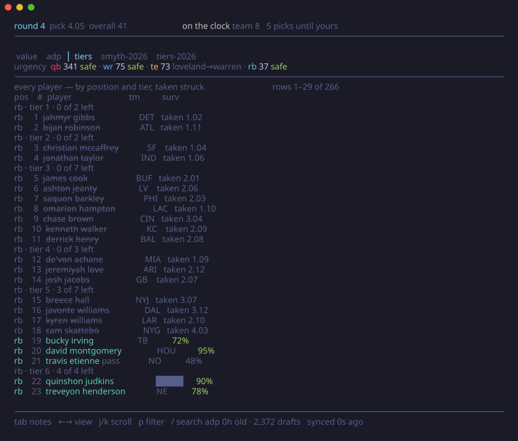
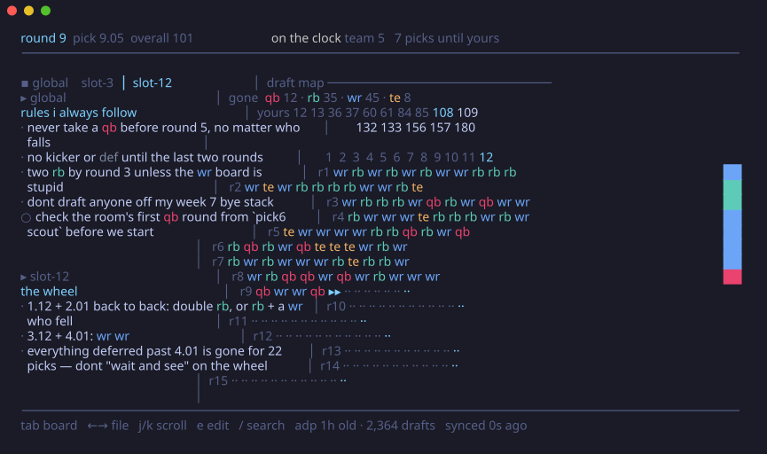
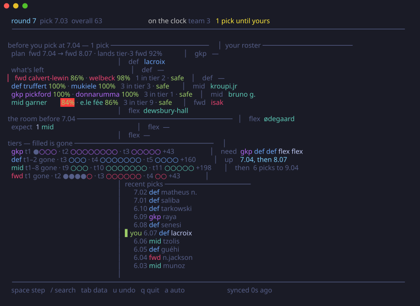

<p align="center">
  
</p>

<h1 align="center">pick6</h1>

<p align="center">
  Terminal war room for fantasy drafts. Live-syncs Sleeper (and FPL Draft), tracks
  tiers, and tells you when the RB run means the value's gone.
</p>

<p align="center">
  <a href="https://github.com/trisslazaj/pick6/releases/latest"></a>
  <a href="https://github.com/trisslazaj/pick6/actions/workflows/ci.yml"></a>
  <a href="LICENSE"></a>
</p>


A scripted room drafts, the cliff banner fires, the ranking re-sorts under it; `a` stops the
clock, `/` finds a player, and `tab` drops to every number the engine holds. Recorded from the
real thing. [`docs/demo.tape`](docs/demo.tape), `vhs docs/demo.tape` to regenerate.

## what it does

- **Survival odds on every player.** The chance he's still there at your next pick, by
  simulating the picks between you and your turn 500 times against your opponents' *actual
  rosters*: their open slots, your room's measured appetites, and the measured share of real
  picks that go to players no board ranks. (`-survival=adp` falls back to the pure
  price-curve model.)
- **Tiers that alarm.** Amber when a tier is probably gone before you act, red when the man on
  screen is the last of it. Tiers come from your rankings file; where it runs out, they're
  derived from the value curve.
- **Run detection that isn't noise.** Four RBs in six picks only fires when it beats what the
  market itself expected for those picks.
- **Your room, not the market.** Feed it your league's past drafts and it reprices survival
  against how *those* people actually draft.
- **A verdict, not a spreadsheet.** On the clock it names a man and the two or three facts that
  justify him, in picks and odds rather than abstract points.
- **Two sports, one engine.** `-sport fpl` points the whole thing at a Fantasy Premier League
  draft *(beta)*. The engine never asks which game it is scoring; it reads your lineup and
  derives the rest.

## install

**Download a release** (no toolchain needed). Grab the tarball for your platform from the
[releases page](https://github.com/trisslazaj/pick6/releases/latest), then:

```sh
tar -xzf pick6_*.tar.gz
xattr -d com.apple.quarantine pick6   # macOS only: clears the "unverified developer" block
mv pick6 ~/bin/                       # or anywhere on your PATH
pick6 version
```

`checksums.txt` on the release page carries the sha256 of every tarball.

**Or with Go:**

```sh
go install github.com/trisslazaj/pick6/cmd/pick6@latest
```

That installs to `go env GOPATH`/bin, which is often not on PATH. `GOBIN=$HOME/bin go install ...`
puts it somewhere that is. Working on the code? `go run ./cmd/pick6 <cmd>` always runs current source.

## quickstart

```sh
pick6 fetch                          # 1. pull data (players, adp, values, tiers)
pick6 live <draft_id> -user yourname # 2. sync your live sleeper draft
```

That's the whole thing. **Your draft id is in the url**: open the draft room in a browser and
it reads `sleeper.com/draft/nfl/<draft_id>`. `-user` finds your seat from the draft order;
`-slot 4` sets it directly if the draft hasn't been seeded yet.

No Sleeper league? `pick6 board` runs the same war room with you typing the picks.

## commands

### `pick6 fetch`

Downloads the Sleeper player pool, half-PPR ADP, and player values; joins everything onto
Sleeper ids; applies your rankings; caches it all. Run it once before drafting and again on
draft morning; inside 12 hours it's served from disk.

```sh
pick6 fetch                            # defaults: 12-team half-ppr
pick6 fetch -format ppr                # other scoring
pick6 fetch -rankings my-tiers.csv     # your tiers and points win (see below)
```

### `pick6 live <draft_id>`

Polls the draft every few seconds and updates the board in place. Every pick is cross-checked
against the snake math; traded picks land on the right roster; a dropped poll self-heals on the
next one. Reads your league's real lineup (two flex? superflex?) from Sleeper.


On the clock the board leads with a **verdict**: the man, his price, his odds, the tier he's
the last of. Then the field, ranked by what the pick is worth.

### `pick6 board`

For in-person drafts, or any platform without an API. `/` finds a player, `x` marks him gone,
`u` takes it back. Everything downstream is identical, because the engine never asks where a
pick came from.

```sh
pick6 board -slot 7 -teams 10 -lineup "qb rb rb wr wr te flex flex k def" -bench 6
```

### `pick6 * -sport fpl`

Every command above takes `-sport fpl` and points at a Fantasy Premier League draft instead.
See [fantasy premier league](#fantasy-premier-league-beta) below.

### `pick6 mock`

Replays a scripted draft against the real UI with real players. Only the pick sequence is
synthetic. `-seed N` replays the same draft every time; `space` steps, `a` autoplays.


Off the clock each ranked row is the position's depth: its best three by value, each with his
odds of still being there when you pick. Under the ranking the pane fills with the board behind
it, showing what the room is about to do (`expect 10 wr · 7 rb · 4 qb`, plus the men likeliest
gone before you pick) and every position's tiers as a row of dots with the taken ones filled in.

### `pick6 tiers`

```sh
pick6 tiers -pos wr -depth 15
```


The paper cheat sheet, but the tool crosses names off by itself: every man at the position,
grouped by tier, straight from the cache. No live draft, no `-slot`, nothing but `-pos` and
`-depth` to slice it.

### the data tab

`tab` flips any board to the numbers, in views you switch with `←`/`→`: **value** is every
available player and every number the engine holds (value, tier, adp, spread, survival, format
gap) with your rankings file's opinions riding the names; **adp** is the same table by
price; **tiers** is the ladder, every man at every position grouped by tier, the taken struck
through; and **every rankings csv** in `~/.config/pick6/rankings/` (or `-rankings <dir>`) is a
view of its own, shown exactly as the file ranks them: its order, its tiers, its opinions,
with nothing added but each man's odds of reaching your pick and a strike once he is gone. The
file you gave `fetch -rankings` is always there. A name the board does not know gets a `?`,
not dropped. A big board — one overall order with the positions mixed — prints flat in the
file's order with the file's own numbers, and `p` filters it without renumbering.




Late in the draft, kickers and defenses light up exactly when they should and not a round
before:


### the notes tab

`tab` again is your own notes, next to the board, so draft night is two screens (this and
sleeper) and not three. It is a folder of markdown files in `~/.config/pick6/notes/`, or
`-notes <dir>`, rendered with player names in their position colours and **struck through
as they get taken**, beside a map of the draft so far. `global.md` sits on top of everything;
`slot-N.md` opens itself when you draw seat N; anything else you flip between with `←`/`→`.
`e` opens the current file in `$EDITOR`. Nothing on it feeds the engine. The notes are your
side of the argument, and the board is the other.



An example folder lives in [`docs/notes-example`](docs/notes-example).

### for the curious

`pick6 scout` profiles each manager's tendencies from your league's cached drafts; `pick6
calibrate` backtests both survival models against real completed drafts and grades every model
choice. The simulation ships because it won that backtest on every draft that could test it
fairly. `pick6 regret` does the same job for *decisions*, which a survival backtest cannot
grade: it replays your own completed drafts with your seat played by each policy in turn (what
you really did, best-available, the formula, each of the two scorers) and prints the team each
one walked out with. None of the three is needed to draft.

## keys

| key | does |
|-----|------|
| `/` | search players; taken ones stay in the results with the pick that took them |
| `x` / `u` | mark taken / undo (board mode) |
| `tab` | cycle board → data table → notes |
| `j` `k` / `p` / `←` `→` | scroll / position filter / switch view (data tab) |
| `←` `→` / `e` | switch file / open it in `$EDITOR` (notes tab) |
| `space` / `a` | step / autoplay (mock mode) |
| `q` | quit |

## fantasy premier league *(beta)*

FPL Draft is a snake draft over a 15-man squad, so it runs on the same engine.

```sh
pick6 fetch -sport fpl
pick6 live -sport fpl <league_id> -slot 3
```

**Use your LEAGUE id**, the number in `draft.premierleague.com/…/league/<id>`. Not the draft id
your league details mention: that returns a real feed for someone *else's* league with the same
number, silently. pick6 refuses a league that has already drafted and names it.

FPL publishes the draft order nowhere until round one happens, so pass `-slot N` once you see
your seat. Add `-user "your name"` and the two get cross-checked as soon as you pick.

`pick6 board -sport fpl` and `pick6 tiers -sport fpl` work the same way.



### what's different

|  | nfl | fpl |
|---|---|---|
| positions | qb rb wr te k def | gkp def mid fwd |
| squad | 9 starters + 6 bench | 15 men: 2 gkp, 5 def, 5 mid, 3 fwd |
| lineup | fixed, with a flex | 11 of the 15, min 3 def / 2 mid / 1 fwd |
| price | average draft position | FPL's `draft_rank` |
| auth | none | none |

You draft 15 and start 11, so 4 sit. Your second keeper is one of them: FPL starts exactly one,
so he is a bench body and the board weights him like one. Everything past the guaranteed
starters competes for the 4 flexible XI places, which is what a flex slot already means.

The squad caps are a **legality** rule. A sixth defender isn't a bad pick, it's one the app
refuses, so the board reads `def full` and the simulated opponents won't take one either.

Both shapes come from FPL's own settings at runtime, so a rule change moves the board with it.

Notes and rankings live in `~/.config/pick6/notes/fpl/` and `~/.config/pick6/rankings/fpl/`, so
a football seat file never lands on a football board. Rankings CSVs work exactly as they do for
the NFL board (see [below](#bring-your-own-rankings)); the only change is that names join
exactly on name + position + team, since FPL names are one-word surnames and three men are
called Wilson.

### what beta means here

**Tested:** 105 real picks from a completed draft replay across all seven seats with zero
desyncs, and the whole engine under a squad.

**Not calibrated:** the opponent model. NFL survival has a referee (`pick6 calibrate`) and NFL
decisions have another (`pick6 regret`). FPL has neither yet. Measured against eight completed
public drafts, the simulated opponents draft by rank order while a real room drafts by squad
need, so they take too few keepers and defenders. A green `safe` tag on a defender is right
about 60% of the time against 81 to 85% elsewhere.

At the table: trust the tiers, the value order, the roster pane and who's gone. Discount the
survival odds on GKP and DEF, and take those a little earlier than the board says. Nothing
measured from NFL drafts is used here; the room curve, escape rates and demand table are all
switched off, and the frame says so.

## bring your own rankings

A CSV turns the board into *your* board. Its tiers drive the cliff alarms, its opinions ride
the names. Column order doesn't matter, unknown columns are ignored, FantasyPros exports load
as-is:

```csv
name,position,team,tier,points,sentiment
Jahmyr Gibbs,RB,,1,,target
De'Von Achane,RB,,4,,avoid
Philadelphia Eagles,DEF,PHI,,,target
```

- `tier`: your tier lines, kept exactly; oversized tiers are subdivided, never merged.
- `points`: projected points; overrides the fetched values.
- `sentiment`: `target` / `pass` / `avoid`. Display-only: an *avoid* badge rides the player's
  name, and a verdict crowning a man you flagged says so. Rows with only a name, position and
  sentiment are valid; that's how kicker and defense calls work.

## the math

Everything on screen is a probability with a paper trail: an opponent-aware Monte Carlo
(rosters, room appetites, and a measured escape rate for picks that leave the ranked board),
survival curves per player, an exactly-N correction, expected-best-later urgency, and
probabilistic tier holds. Every constant was chosen by backtesting against real completed
drafts. The whole derivation, the calibration methodology, and the ideas that measured worse
and were removed (including the leak that briefly flattered the simulation) live in
[**the engine paper**](docs/pick6-engine.pdf) (also attached to every
[release](https://github.com/trisslazaj/pick6/releases/latest)).

## data sources

- **ADP** from [Fantasy Football Calculator](https://fantasyfootballcalculator.com), whose free
  ADP API made this possible.
- **Player values and ID crosswalk** from [FantasyCalc](https://fantasycalc.com).
- **Player pool and live draft feed** from [Sleeper](https://docs.sleeper.com/).

## license

MIT. See [LICENSE](LICENSE).
